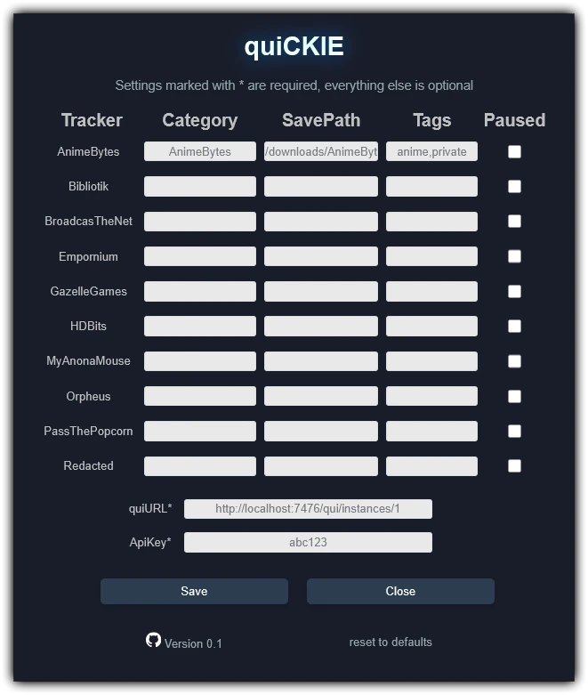

  # **🐰 quiCKIE 🐰**

  

 

This [UserScript](https://openuserjs.org/about/Userscript-Beginners-HOWTO) will integrate **BunnyButtons 🐰** alongside a trackers regular download buttons. When clicked, the corresponding torrent will be added directly to your torrent client using your custom settings.

quiCKIE currently supports **[qui](https://getqui.com/)**, **[qBitTorrent](https://www.qbittorrent.org/)**, **[Transmission](https://transmissionbt.com/)**, **[Deluge](https://deluge-torrent.org/)**, both **desktop**\\**mobile** devices, and **40+** different trackers. In addition, this is a **non-destructive** UserScript, which ensures quiCKIE to be friendly\compatible with other UserScripts and default browser functions.

If a tracker that you have access to is not listed, check the quiCKIE WiKi for a simple **3-step guide** on how it can be added, no programming experience required: **[Adding a New Tracker](https://github.com/WirlyWirly/quiCKIE/wiki/Adding-a-New-Tracker)**

The quiCKIE settings panel can be accessed by performing a **Shift-Click** on any BunnyButton or from the menu of your UserScript Manager, which is the dialogue on your toolbar that lists the currently active UserScripts.

Only the **clientURL** and **credentials** for the selected torrent client are required, everything else is optional. Hover over the various emojis for details about what each field does and how it may be filled in.

 

> **Left-Click \ Mobile Tap**: Add torrent to client with settings for the current tracker 
> **Right-Click \ Mobile Long-press**: Add torrent to client with settings from the selected preset 
> **Middle-Click**: Open torrent client in a new tab 
>
> **Shift-Click**: Open quiCKIE settings panel 
> **Ctrl-Click**: Open torrent client in a new tab 
> **Shift-Ctrl-Click**: Add torrent to client, but with 'Start Paused' enabled (also works on presets) 
>
> **BunnyButton Emojiography*** 
> 🐰 = Default | 🌱 = Seeding | 🍁 = Snatched | 💎 = Freeleech | 📢 = Featured | 💸 = Spend Token | 🤝 = ThirdParty | 🌎 = ThirdParty + TrackerSettings 
> 🧲 = Downloading .torrent file | 🧑 = Client Login | 🕓 = Sending Torrent | ✔️ = Success | ❌ = Failure
>
> **Source: [GitHub](https://github.com/WirlyWirly/quiCKIE)** 
> **Install: [qui - quiCKIE](https://raw.githubusercontent.com/WirlyWirly/quiCKIE/main/quiCKIE.user.js?raw=true)** 
> Written for [LibreWolf](https://librewolf.net/) via [Violentmonkey](https://violentmonkey.github.io/) 
>
> \* *Full BunnyButton Emojiography is available on select trackers*
>

 

# Integrating Third-Party UserScripts
If you are the author of a UserScript that creates torrent `DL` (Download) buttons on a page that is also serviced by quiCKIE, you can very easily add quiCKIE integration so that your `DL` elements receive their very own and fully functioning BunnyButton 🐰: [Integrating Third-Party UserScripts](https://github.com/WirlyWirly/quiCKIE/wiki/Integrating-Other-UserScripts)

 

 quiCKIE v0.1: A ramble 

The day before I began work on quiCKIE, I had migrated all my torrents from Transmission to qBitTorrent so that I could use that fancy new web-interface all the kids cooler than me were talking about; qui

After getting home from work and poking around this still foregin interface, I stumbled onto the api documentation. Reading through the documentation and learning about the capabilities of the api, I thought that since I'm already using a fancy new interface, I might as well have a fancy new way to add\manage my torrents... My custom shell script for organizing torrents would need to be re-written anyways if I were going to use it with qBitTorrent, so maybe after 10 years of doing the same thing, a fresh approach was in order... So.. UserScript? 🤔

Yeah, a UserScript! 🤯 One that would let me send torrents directly from one of my trackers to this fancy new qui interface! It'll even categorize them based on what tracker I sent it from! 🥳... Also, it **has** to work on my phone, since that's where I do most of my browsing and I **hate** having to do **any** kind of torrent\media\file mangement on a touch screen 😤

After that hit of inspiration, I got to work on this idea of mine! It would be fresh, it would be reliable, and most importantly it wouldn't look like shit! 👏... Which I would immedietaly regret, because I almost cried getting the CSS to work 😭 To this day, I'm not confident in the CSS code and I'm still afraid of touching it for fear I'll break something 😟

Even so, it was a few hours after I began that my then unnamed UserScript added its very first torrent to qui! 🥳

> Fun-fact: The first torrent to **ever** be sent by this script (even before it had a name) was from MyAnonaMouse 🐭

After I had it working, I added the other trackers I use and was ready to finalize my work. I'd made it easy for myself to add more trackers in the future, so I could come back to it if I ended up joining another tracker... However, I also added a few more optional settings I thought I might one day find useful, one of which was **Start Paused**

The problem was, I couldn't actually get that setting to work 😕... Also, it was bedtime, and since I didn't want to finalize a faulty UserScript, what was suppose to be `v1.0 [Final]` became `v0.1`.

Before going to bed, I posted quiCKIE onto a few forums for folk to check out, with a disclaimer that *Start Paused* wasn't working yet... That might have been a mistake, because in my mind this project was still open for editing, which means inspiration hit again while I was at work the next day... and then again the next day... and the next... It was another **month** before I would push `v1.0`, which again was **suppose** to be *Final*, but after a few days inspiration hit **again**... At that point, I gave up on finalizing this script, and now we're at whatever version is current 😅

Even so, while there are a few more options and trackers now than what I had originally planned for, overall I'm happy with the result and I think it still remains identifiable to that little ~400 line script I put together that night before bedtime 🛌

This script is written to be reliable, maintainable, and expandable, so hopefully the work put in by myself and my contributors will continue to give dividends for not only myself, but anyone in the community who happens upon this page 🍻

  

    
  

P.S
As for the name, I feel that needs no explanation, there was only ever one option...

> Me: Hmm, what's a good name?... qui... like *qui*ck?... No! Like *QUICKIE*! 🤯

